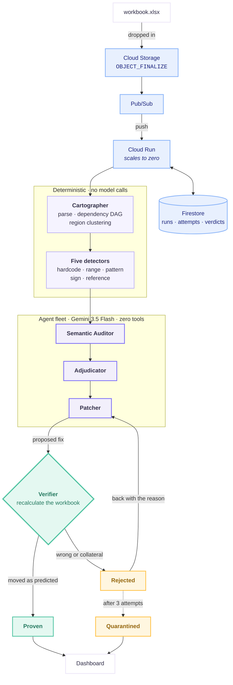

# Cassandra

**Continuous integration for the spreadsheets that run your company.**

An autonomous agent fleet that finds the defect, writes the fix, and proves it by recalculating the workbook. Nothing reaches you that the system has not first proven to itself.

Built for the All Things Agentic Hackathon on Gemini 3.5 Flash, Google ADK, Cloud Run, Pub/Sub, Cloud Storage, and Firestore.

---

## The problem

Spreadsheets are the largest untested codebase on earth. They allocate budgets, price deals, and set national policy, and essentially none of them are under test.

- **94%** of spreadsheets contain at least one error
- **95%** of financial models audited by KPMG contained major errors, 75% contained significant accounting errors
- **~5%** contain outright show stopper errors
- Developers estimate their own error rate at **10 to 18%**. The measured rate is **86%**

That last gap is the real problem. The errors are everywhere, they are consequential, and the people who wrote them are confident they are not there. A wrong formula looks exactly like a right one.

The Reinhart and Rogoff austerity paper shaped global fiscal policy off a summation range that omitted five rows. JPMorgan's London Whale loss involved a spreadsheet copy and paste error inside a $6.5B hole.

**Nobody audits spreadsheets** because auditing them by hand is unbearable, and every existing tool requires a human to stop, open a file, and read a wall of warnings. So it never happens, and the error ships.

---

## Three ways in, one artifact out

| Source | How |
| --- | --- |
| **Any workbook** | Drop an `.xlsx` or `.xlsm` on the page, or pick one |
| **Google Sheets** | Paste a link. No OAuth: sheets shared as *anyone with the link* export directly, so nobody grants an application access to their whole Drive to audit one file |
| **A bucket** | An object landing in Cloud Storage starts an audit with no human involved at all |

Out the other end is **the corrected workbook**, with every verified correction applied and everything quarantined or awaiting a human deliberately left alone. That is the difference between a report and a repair.

A CSV is refused rather than accepted, with the reason: it holds values and no formulas, and the defects Cassandra finds are defects in how a number was computed, which a CSV has already discarded.

## What Cassandra does

Drop a workbook in by any of the routes above. Cassandra wakes from zero, and:

1. Parses it into a formula dependency graph
2. Clusters cells into regions that should share one intent
3. Runs five deterministic detectors plus a semantic agent to locate candidate defects
4. Ranks them by blast radius through the graph, weighted toward the figures a human actually quotes
5. Rules on each one, dismissing legitimate modelling patterns
6. Writes a concrete repair
7. **Applies the repair to a copy, recalculates the entire workbook, and rejects the repair unless the target moved exactly as predicted with no collateral movement**

Rejected patches go back to the Patcher carrying the reason they failed. After three attempts the finding is quarantined for a human rather than guessed at.

Each correction is proven on its own against the original workbook, which is the right way to prove one repair and the wrong way to report a result: applied together the corrections interact, and repairing a revenue range offsets an expense sign inversion further down. So the whole set is applied at once and the workbook recalculated a final time. **The figure on screen is the figure the downloaded file computes.**

Drop the next revision of the same workbook and Cassandra becomes a regression sentinel, diffing it against the previous run and reporting what is newly broken.

### A real run, unedited

```
[  0.01s] parsed         81 cells across 3 sheets, 26 of them formulas
[  0.01s] mapped         dependency graph built, 52 edges, 6 terminal output figures
[  0.01s] clustered      5 regions, 2 cells break their region's pattern
[  0.71s] detected       6 candidate defects located
[ 35.8s]  agent_finding  semantic mismatch at PL!C10: labelled 'Net Margin' but computes Gross Margin
[ 42.0s]  dismissed      Revenue!B5 dismissed: standard modelling pattern where the first cell
                         in a time series seeds the projection from an input assumption
[ 84.4s]  confirmed      Revenue!D12 material: hardcodes 18% instead of referencing the driver
[ 84.4s]  patching       patcher attempt 1 of 3
[ 95.2s]  rejected       attempt 1 rejected: patch changed nothing at Revenue!D12
[ 95.2s]  patching       patcher attempt 2 of 3
[110.9s]  verified       repaired and proven: =D6*Assumptions!$B$5
```

That rejection is not staged. The Patcher's first attempt was refused by recalculation, it read the reason, recognised the defect was latent, and returned a repair that verified.

---

## Architecture



More diagrams, including the verification loop and exactly where the model is trusted, are in [docs/architecture.md](docs/architecture.md).

### Design principles

**Deterministic before probabilistic.** A parser establishes ground truth about a workbook better than a model can. Detection, graph construction, clustering, and verification are all plain code. The model is consulted at exactly three points, each a question a parser genuinely cannot answer.

**Nothing is asserted that is not verified.** Every claim reaching the user passed a recalculation first. The Verifier does not ask the model anything.

**The agents hold no tools.** Not one can read a file, mutate a workbook, or reach the network. Each receives evidence assembled by deterministic code and returns a typed judgement. A prompt injected into a cell label can at worst produce a wrong judgement, which the Verifier then rejects by recalculation. This is a stronger guarantee than scoping tools narrowly and trusting the model not to misuse them.

**The control flow is code, not an agent.** There is no path by which a model decides what happens next. That is the difference between a system that fails predictably and one that wanders.

**Delivery is idempotent.** Pub/Sub delivers at least once. Claims are a Firestore `create`, which fails if the document exists, so two workers racing the same redelivered message produce one winner without a lock.

---

## Two techniques worth calling out

### Proving a defect that has no wrong value yet

A hardcoded constant that happens to equal the assumption it replaced computes the correct answer today. It is still defective: the cell has been silently cut off from its driver and goes stale the moment the assumption moves. No static check can see it, and recalculating the workbook as it stands reveals nothing.

Cassandra proves it by **differential counterfactual**. Patched and unpatched workbooks must **agree as things stand**, which is what makes the defect invisible, and must **diverge once the driver is perturbed**, which is what proves the cell was decoupled.

Asking only whether the target moves when the driver moves is unsound, because the target may still reach the driver by an indirect path. Comparing the two workbooks against each other isolates the hardcode itself.

### Separating root causes from symptoms

When a total is wrong, every figure downstream of it is also wrong, and reporting all of them as separate defects is noise. But being downstream does not mean a cell is only a symptom: it may be independently broken as well.

Cassandra suppresses a downstream finding **only when it is purely semantic**. If a structural detector read the cell's own formula and objected, no amount of repairing its inputs makes that cell correct.

---

## Running it

### Prerequisites

- Python 3.11 (3.12+ is untested; 3.14 has no wheels for parts of this stack)
- A Google Cloud project with billing enabled
- `gcloud` CLI

### Local

```bash
git clone https://github.com/ahammadshawki8/Cassandra.git
cd Cassandra

python3.11 -m venv .venv
source .venv/bin/activate          # Windows: .venv\Scripts\activate
pip install -r requirements-service.txt

gcloud auth application-default login
gcloud auth application-default set-quota-project YOUR_PROJECT_ID

cat > .env <<'EOF'
GOOGLE_GENAI_USE_VERTEXAI=TRUE
GOOGLE_CLOUD_PROJECT=YOUR_PROJECT_ID
GOOGLE_CLOUD_LOCATION=global
CASSANDRA_MODEL=gemini-3.5-flash
GCP_PROJECT_ID=YOUR_PROJECT_ID
EOF

python -m cassandra.demo.build_workbook       # writes the demo workbook
uvicorn cassandra.service.app:app --reload --port 8080
```

Open http://localhost:8080 and press **Run audit**.

> **`GOOGLE_CLOUD_LOCATION=global` is not optional.** Gemini 3.x is served only from `global` on Vertex AI. Any regional endpoint returns 404 for every 3.x model while serving 2.5 happily, which looks exactly like a permissions problem and is not.

### Tests

```bash
pip install pytest && pytest -q
```

### Deploying the full cloud pipeline

```bash
PROJECT=YOUR_PROJECT_ID
REGION=us-central1
BUCKET=${PROJECT}-workbooks

gcloud config set project $PROJECT

gcloud services enable \
  aiplatform.googleapis.com run.googleapis.com storage.googleapis.com \
  pubsub.googleapis.com firestore.googleapis.com cloudbuild.googleapis.com \
  artifactregistry.googleapis.com cloudtrace.googleapis.com

gcloud storage buckets create gs://$BUCKET --location=$REGION --uniform-bucket-level-access
gcloud pubsub topics create cassandra-workbook-landed
gcloud firestore databases create --database='(default)' --location=nam5 --type=firestore-native

gcloud storage buckets notifications create gs://$BUCKET \
  --topic=cassandra-workbook-landed --event-types=OBJECT_FINALIZE

gcloud run deploy cassandra --source . --region $REGION --allow-unauthenticated \
  --memory 2Gi --cpu 2 --timeout 900 --max-instances 3 \
  --set-env-vars "GOOGLE_GENAI_USE_VERTEXAI=TRUE,GOOGLE_CLOUD_PROJECT=$PROJECT,GOOGLE_CLOUD_LOCATION=global,CASSANDRA_MODEL=gemini-3.5-flash,GCP_PROJECT_ID=$PROJECT,CASSANDRA_BUCKET=$BUCKET"

URL=$(gcloud run services describe cassandra --region $REGION --format='value(status.url)')

gcloud pubsub subscriptions create cassandra-push \
  --topic=cassandra-workbook-landed --push-endpoint="$URL/pubsub" --ack-deadline=60

gcloud storage cp demo/saas_projection_v11.xlsx gs://$BUCKET/
```

Open `$URL` and watch it wake.

### Cost

Cloud Run scales to zero, so the service costs nothing idle. One audit of the demo workbook is a handful of Gemini 3.5 Flash calls. Set `--max-instances` low and delete the bucket notification when finished.

---

## Prior art, and how this differs

Spreadsheet error detection is a mature field. Cassandra stands on it rather than claiming to be unprecedented.

| Prior work | What it does |
| --- | --- |
| [PerfectXL](https://www.perfectxl.com/), [Operis OAK](https://www.operisanalysiskit.com/) | Commercial static inspection, pattern highlighting, risk reports |
| [CUSTODES (ICSE 2016)](https://cs.nju.edu.cn/changxu/1_publications/16/ICSE16.pdf) | Cell clustering by tabulation style, smell detection at F measure 0.72 |
| [ExceLint](https://arxiv.org/pdf/1901.11100) | Automatically finding spreadsheet formula errors |
| [SpreadsheetLLM](https://arxiv.org/abs/2407.09025) | Encoding spreadsheets for language models |
| [arXiv 2508.11715](https://arxiv.org/pdf/2508.11715) | LLM formula repair verified against a calculation engine |

**The gap they share:** every one of them audits a static artifact, at a point in time, when a human decides to stop and open a file. They are linters. They require exactly the human attention whose absence causes the problem.

**What Cassandra adds:**

1. **It runs as infrastructure, not as a tool.** The audit is triggered by the file existing. That removes the human bottleneck which is the actual root cause.
2. **It catches the regression, not just the defect.** No tool above answers "this was fine last week, what broke since." Revisions are paired by a lineage key that survives the endings people actually use, so `v12` is recognised as the next revision of `v11`, and anything newly broken is reported as such.
3. **It proves its own fixes.** Existing tools emit warnings for a human to adjudicate. Cassandra writes the patch and refuses to surface it until recalculation confirms it does exactly what was predicted and nothing more.
4. **It ranks by consequence, not by rule violation.** Findings are sorted by blast radius through the dependency graph weighted toward terminal output figures.
5. **It proves latent defects**, which have no wrong value today and are invisible to every static check.

The detection layer stands on established research, and that is a strength. The autonomous, continuous, self verifying, regression aware composition does not exist as a product or a paper.

---

## Validated against workbooks it was not designed around

The demo model contains exactly the defects the detectors look for, which makes it circular as evidence. Three further workbooks in `demo/` answer what it cannot. Build them with `python -m cassandra.demo.build_fixtures`.

| Workbook | Question it answers | Result |
| --- | --- | --- |
| `clean_amortisation.xlsx` | Does it invent findings on a correct file? | **Nothing reported.** 123 formulas, one candidate raised and dismissed as a legitimate series seed |
| `dept_budget.xlsx` | Does it work on a shape it has never seen? | **One of two.** Found and repaired a reversed variance; declined a short subtotal as ambiguous |
| `saas_projection_v12.xlsx` | Does the regression sentinel fire? | Pairs with `_v11` by lineage and reports what is newly broken |

The most important of these is the first. A tool that cries wolf on a healthy workbook is worse than no tool, and on 123 correct formulas it stayed quiet.

The second is the honest one. `Budget!C15`, a subtotal stopping one row short, was detected at 0.45 confidence and then dismissed by the Adjudicator as "likely a subtotal specifically for the first group of items" — a defensible reading of a cell labelled only "Total committed". That is the instructed conservatism working as designed, and it is also a real recall cost. Both directions are stated because only one of them is flattering.

## What it cannot do

Stated plainly, because a system that audits other people's work should be honest about its own limits.

- **Recalculation proves mechanical soundness, not intent.** Where the workbook no longer holds enough information to infer what the author meant, the clearest case being a reference whose target was deleted, the repair is labelled `needs_human_intent` rather than presented as proven.
- **A hardcode is only found where a pattern exists to break.** The detector reports a cell that deviates from its region's norm, so a hardcoded constant sitting in a column of five different formulas has nothing to deviate from. Found by planting exactly that and watching Cassandra miss it. This covers most of a real model, where rows and columns are dragged, and not all of it.
- **Recall is traded for precision on purpose.** The Adjudicator is instructed to be conservative, because a false alarm costs an analyst an hour and teaches them to ignore the tool. A genuine defect can therefore be talked out of, as one was on the budget fixture.
- **`formulas` does not implement every Excel function.** Anything it cannot evaluate degrades to unverified and is never reported as proven.
- **Repairs are proposed, not written back.** Cassandra never modifies your workbook. Every patch is applied to a temporary copy.
- **One audit at a time per instance.** A process level lock, so a second request is told the service is busy rather than queued.
- **The deployed endpoint is unauthenticated.** Fine for judging, wrong for anything else: anyone with the URL can spend the project's model quota.
- **Google Sheets import is tested but not yet confirmed against a live sheet.** Every path is covered with the call to Google stubbed; the last mile needs a real shared link.

---

## Layout

```
cassandra/
  core/
    model.py       cell, sheet, workbook types
    refs.py        reference parsing and R1C1 normalization
    parser.py      xlsx into the cell model
    graph.py       dependency DAG, blast radius, impact scoring
    regions.py     clustering cells that share one intent
    detectors.py   five deterministic detectors
    oracle.py      the calculation oracle and the Verifier
  agents/
    schemas.py     typed agent outputs
    fleet.py       the ADK agents
  service/
    app.py         Cloud Run service, Pub/Sub push, SSE, dashboard
    store.py       Firestore persistence and the idempotency guard
    static/        the dashboard
  demo/
    build_workbook.py   the demo model with planted defects
  orchestrator.py  the audit run
tests/             36 tests over the deterministic core
```

## License

MIT
