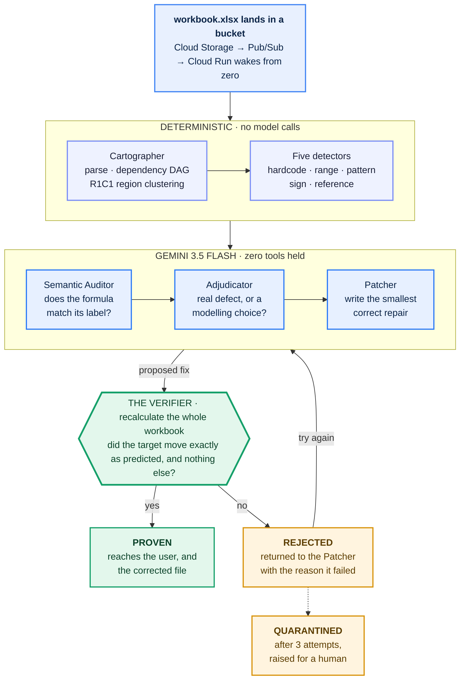
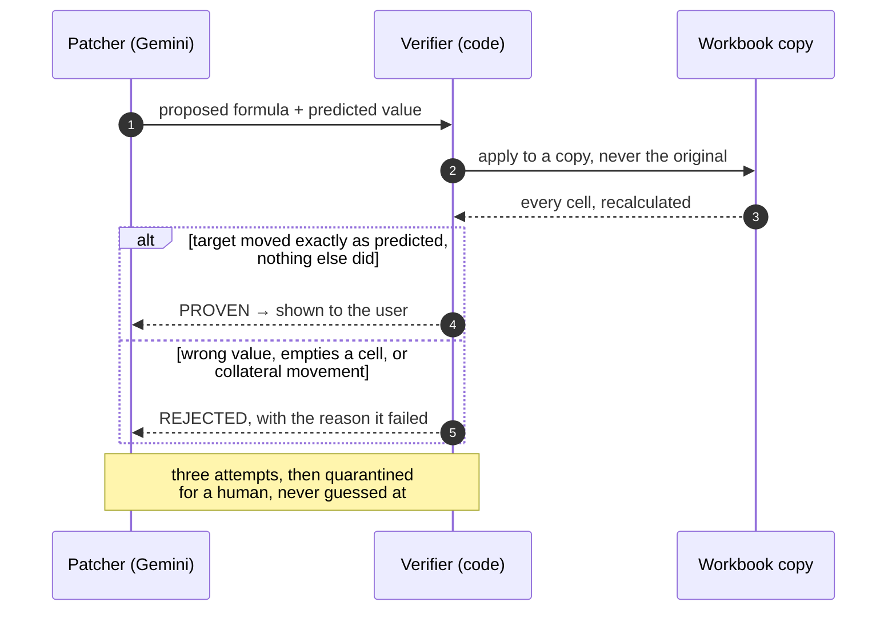

# Cassandra

**Continuous integration for the spreadsheets that run your company.**

---

## How much would you bet that the spreadsheet behind your last big decision is correct?

Because here is what the research says about that bet.

- **94%** of spreadsheets contain at least one error, across seven separate field audits (Panko, *What We Know About Spreadsheet Errors*).
- **95%** of financial models KPMG audited had **major** errors. 75% had significant accounting errors.
- And the part that should genuinely worry you: when researchers ask the people who **built** those models how often they make a mistake, they answer around **14%**. The measured rate is **86%**.

That last gap is the whole problem. The errors are everywhere, they are consequential, and the people responsible are quietly certain theirs is fine.

**Nobody audits a spreadsheet, because nobody believes theirs is the broken one.**

So we built something that does not need to be believed. It finds the defect, writes the fix, and then **proves the fix by recalculating your workbook**, and refuses to show you anything that did not survive that test.

---

## Inspiration

**A number that was wrong for years, in public.**

- **Reinhart and Rogoff** published a paper that shaped austerity policy across the developed world. The headline finding rested on a summation range that **omitted five rows**. It stood for three years before a graduate student got the raw file.
- **JPMorgan's London Whale** loss involved a copy and paste error inside a spreadsheet, inside a **$6.5B** hole.
- These are not exotic bugs. They are the two most ordinary spreadsheet mistakes there are: a range that stops one row short, and a value pasted where a formula belonged.

**The tools already exist. That is not the problem.**

- Spreadsheet error detection is a genuinely mature research field. **CUSTODES (ICSE 2016)** clusters cells by tabulation style and finds smells at F-measure 0.72. **ExceLint** finds formula errors structurally. Commercial auditors like PerfectXL and Operis OAK have been sold to banks for years.
- Every single one of them **waits for a human to stop, open a file, and read a wall of warnings.** They are linters. They require exactly the attention whose absence causes the problem in the first place.

**So the friction is not detection. It is that the audit never happens.**

- We stopped asking "how do we find spreadsheet errors" and started asking **"how do we make the audit happen without anyone deciding to do it"**, and then, once it has happened, **"why should anyone believe the result?"**
- Both answers turned out to be the same idea: make the system prove its own work, so no human judgement is required to trust it.

---

## What it does

**Drop a workbook in. Two minutes later you get the corrected file and the proof.**

- **Zero touch ingestion.** A workbook landing in a Cloud Storage bucket fires an event. Cloud Run wakes from zero and audits it. There is no upload button, no OAuth screen, no human trigger. **The audit happens because the file exists.**
- **Three ways in.** Drag and drop any `.xlsx`/`.xlsm`, paste a **Google Sheets link** (via the export endpoint Sheets already provides, no OAuth, so nobody grants an app access to their whole Drive to audit one file), or let a bucket event start it.
- **Six defect classes.** Hardcoded constants buried in formulas, off by one aggregation ranges, cells breaking their region's pattern, sign inversions, broken references, and formulas that disagree with their own label.
- **Verification by recalculation.** Every correction is applied to a copy and the **entire workbook is recomputed**. Did the target move exactly as predicted? Did anything move outside its blast radius? Fail either and the correction is rejected and sent back with the reason.
- **Materiality ranking.** Findings are ordered by blast radius through the dependency graph, weighted toward terminal output cells, the figures a person actually quotes in a meeting. Not "17 warnings" in arbitrary order.
- **The corrected workbook, downloadable.** Every proven correction applied, anything uncertain deliberately left alone, your original never touched. **A repair, not a report.**
- **A regression sentinel.** Drop the next revision and it pairs them by lineage and reports **what is newly broken since last time.**
- **Institutional memory.** Mark a finding as fine and it is never raised again on later revisions of that model.

### What one real run found

On a three-year SaaS projection, in **114 seconds**, with nobody involved after the file landed:

| Cell | Was | Became |
| --- | --- | --- |
| `PL!C8` | `=C6+C7` | `=C6-C7` |
| `Revenue!F16` | `=SUM(B15:D15)` | `=SUM(B15:E15)` |
| `Revenue!D12` | `=D6*0.18` | `=D6*Assumptions!$B$5` |
| `PL!C13` | `=Revenue!#REF!*4` | `=Revenue!C12*4` |

**The workbook reported $6,246,545 of operating income for a company that actually lost $1,704,250.** Operating expenses were being *added* to gross profit instead of subtracted. One character. A **$7.95M** overstatement in the figure going to a board.

---

## How we built it

**The organising principle: deterministic before probabilistic.**

- A parser establishes ground truth about a workbook far better than a language model can, exhaustively, repeatably, and for free. So parsing, the dependency graph, region clustering, all five structural detectors, and **every verification** are plain Python.
- Gemini is asked exactly three questions, each one a genuine judgement a parser cannot make.

**The event driven spine (Google Cloud, end to end).**

- **Cloud Storage** `OBJECT_FINALIZE` → **Pub/Sub** → push to **Cloud Run** → **Firestore** for run state, patch attempts, verdicts, and dismissals.
- **Gemini 3.5 Flash via Vertex AI**, orchestrated with **Google ADK**. *(Note for anyone reproducing this: Gemini 3.x is served only from `location=global` on Vertex, regional endpoints 404 on every 3.x model while happily serving 2.5.)*
- Cloud Run **scales to zero**, so an idle auditor costs nothing.

**Region clustering, straight out of the literature.**

- Financial models are built by writing one formula and dragging it. Every cell in that stretch shares one intent, so under **R1C1 normalisation** they collapse to a single signature. A cell whose signature differs was hand edited, and hand edits inside a dragged range are where defects live.
- This is the **CUSTODES** insight implemented directly: defective cells surface as outliers within clusters formed by tabulation style.
- We added one refinement the papers do not: the **first cell of a series is legitimately different** (it seeds from an assumption rather than the prior period), so boundary outliers are separated from interior ones and carry lower confidence. This kills the single most common false positive in signature clustering.

**The Verifier: the only authority in the system.**

- **The Verifier asks the model nothing.** It is arithmetic. That is what makes the guarantee meaningful.
- This follows the methodology established in **arXiv 2508.11715** (*Benchmark Dataset Generation and Evaluation for Excel Formula Repair with LLMs*), which validates LLM-written repairs against a calculation engine. We took that idea and made it the system's **only** source of truth rather than one evaluation step.

**Proving a defect that has no wrong value yet.**

- A hardcoded `0.18` that happens to equal the assumption it replaced computes the **correct answer today**. It is still broken: the cell has been silently cut off from its driver and goes stale the moment anyone updates that assumption. No static check can see it, and recalculating the workbook as it stands reveals nothing.
- We prove it with a **differential counterfactual**: patched and unpatched workbooks must **agree as things stand** (that is what makes it invisible), and must **diverge once the driver is perturbed** (that is what proves it was decoupled).
- Asking only "does the target move when the driver moves" is unsound, the target may still reach the driver by an indirect path. Comparing the two workbooks against each other isolates the hardcode itself.

**Security posture: the agents hold no tools.**

- Not one agent can read a file, mutate a workbook, or reach the network. Each receives evidence assembled by deterministic code and returns a **typed Pydantic object**.
- A prompt injected into a cell label can, at absolute worst, produce a wrong judgement, which the Verifier then rejects by recalculating, **because the Verifier does not ask the model anything.**
- This is a stronger guarantee than scoping tools narrowly and hoping the model behaves.

**Reliability details that matter.**

- **Idempotency:** Pub/Sub delivers at least once. Deliveries are claimed with a Firestore `create`, which fails if the document exists, so two workers racing the same redelivered message produce one winner without a lock.
- **Resumability:** state lives in Firestore, not in process memory.
- **CPU allocation:** Cloud Run throttles a container to near-zero CPU once it responds. Since we answer the Pub/Sub push immediately and audit on a worker thread, `--no-cpu-throttling` is a correctness requirement, not a tuning knob.

---

## Challenges we ran into

**We spent more effort attacking our own guarantee than defending it.**

- **The Verifier was too easy to fool.** Pointing a formula at an empty cell satisfies both conditions, the value moved and nothing else did, which made destroying a figure the cheapest way to pass. Emptying a cell that held a value is now rejected outright.
- **We fed it a correct patch with a hallucinated prediction**, deliberately. It answered `predicted 999.0 but recalculation produced 100.0`. That is now a permanent test, and it is the same behaviour a judge sees on camera.

**The number on screen has to be the number in the file.**

- Each correction is proven on its own against the original workbook, which is right for proving one repair and wrong for reporting a result. Applied together they interact: repairing a revenue range offsets an expense sign inversion further down.
- We now apply the whole set at once and recalculate a final time, so a judge can download the corrected workbook and confirm the headline figure themselves.

**Downstream is not the same as symptomatic.**

- Suppressing every finding inside a repaired cell's blast radius looked correct and silently discarded two genuine defects, including the sign inversion responsible for the entire $7.95M swing.
- Only a purely semantic complaint can be explained away by an upstream repair. If a structural detector read the cell's own formula and objected, no amount of fixing its inputs makes that cell correct.

**Three Google Cloud traps worth passing on.**

- **Cloud Run reserves `/healthz`.** It never reaches your container and returns Google's own 404 while every other route serves perfectly, which reads exactly like a service that failed to start.
- **Gemini 3.x is served only from `location=global` on Vertex.** Regional endpoints 404 on every 3.x model while happily serving 2.5, which looks like missing access and is not.
- **CPU allocation is a correctness requirement here.** Cloud Run throttles a container to nearly no CPU once it responds, and this service answers the Pub/Sub push immediately and audits on a worker thread. `--no-cpu-throttling` is not a tuning knob.

---

## Accomplishments that we're proud of

**It stays quiet on a healthy workbook.**

- We built a **correct** 123-formula loan amortisation schedule, different shape, different functions, nothing wrong with it, and ran it.
- **Nothing reported.** One cell was examined, correctly identified as a legitimate series seed, and dismissed. **Zero false positives.**
- This matters more than any catch. A tool that cries wolf on a healthy model is worse than no tool, because it teaches people to stop reading it.

**It works on workbooks it was never designed around.**

- The demo model contains exactly the defects our detectors look for, which makes it circular as evidence. So we built a departmental budget with an entirely different structure, variance columns, subtotals, and planted defects written to be plausible rather than convenient.
- It **found and repaired** a variance subtraction reversed against the rest of its column, and correctly suppressed the two cells downstream of it as symptoms.

**The self-correction loop is real, and it is on camera.**

- `Revenue!D12`: attempt one **rejected** by recalculation. The agent read the reason, recognised the defect was latent, and returned a repair that verified.
- That sequence was never staged. It is the clearest evidence that the loop is a real control structure rather than a diagram in a README.

**The autonomous path, proven unattended in production.**

- A workbook dropped into the bucket at 01:52:44 with no browser open and no deploy in flight. Run `9a5887a773f6` landed 114 seconds later: 8 findings, 5 repaired, persisted to Firestore. **No human action after the file existed.**

**The regression sentinel fires on a real revision.**

- v11 audited, every defect repaired, then v12 dropped with one fresh mistake. It reported: **`Revenue!D6` is newly broken in this revision, a hardcoded 12% multiplier has been inserted into the revenue calculation.**

**62 tests** covering the deterministic core, the failure modes of the Verifier, every ingestion path, and the lineage logic.

---

## What we learned

- **A verifier is only as good as the failures it anticipates.** Every "clever" way our own agent found to pass verification without doing the work became a permanent test. We attacked our own guarantee harder than we defended it.
- **Some defects have no wrong value.** This reframed the whole project. Correctness is not just "is this number right today", it is "will this number still be right when someone changes an assumption." That required a counterfactual, not an observation.
- **Deterministic code beat the model wherever both could do the job.** The parser is exhaustive, repeatable, and free. Handing the model twelve pre-located candidates with peer context beats asking it to scan a grid, better results, a fraction of the tokens.
- **Zero tools is a stronger security posture than careful tools.** We started intending to scope each agent's tools narrowly. We ended up giving them none, which turns prompt injection from a vulnerability into an inconvenience.
- **The judgement call that shaped the product: we refused to support CSV.** A CSV holds values and no formulas. The defects we find are defects in *how a number was computed*, which CSV has already discarded. Accepting one would mean always reporting "clean." It is refused with that explanation instead.

---

## What's next for Cassandra

- **Write-back with approval.** Cassandra proposes; a reviewer approves; corrections are committed to the source of record with a full audit trail.
- **Cross-workbook lineage.** When model A feeds model B feeds the board deck, a break upstream should surface against every downstream consumer automatically.
- **Scheduled sentinels.** Watch a Drive folder or a bucket prefix continuously and report only what changed since the last pass.
- **A defect corpus and public benchmark.** Score Cassandra against the EUSES and Enron spreadsheet corpora used across the literature, and publish precision and recall per defect class.
- **Slack and email digests.** A weekly "here is what moved in your models, and here is the proof" instead of a dashboard nobody opens.

---

## Why we believe this deserves the top prize

**It is autonomous in the way the brief actually means.**

- The audit is triggered by a file existing. Not by a chat prompt, not by a button, not by a human deciding today is the day. It runs for two minutes on its own, makes real decisions, and produces a downloadable artifact.
- We proved this unattended on the deployed service: a workbook dropped into the bucket with no browser open, and 114 seconds later a completed run sitting in Firestore. **The human enters only at accept or dismiss.**

**It has a ground truth oracle, which almost no agent project does.**

- This is the difference that matters. Most agent demos ask a judge to *believe* that plausible looking output is correct, because nothing in the system can tell. Cassandra recalculates the workbook and shows the number move, and a judge can download the file and check it independently.
- The rubric asks directly how a system recovers when a worker agent returns a hallucination. Our answer is not a paragraph in a README. It is a rejection message with the reason attached, followed by a successful second attempt, visible on camera in an unedited run.

**It solves a friction that is measured, not imagined.**

- We are not guessing that this problem exists. 94% of spreadsheets carry an error, 95% of audited financial models had major ones, and the people who wrote them believe their own error rate is six times lower than it is.
- On our demo model that gap is worth **$7.95M** in a single figure headed for a board, caused by one character in one formula.

**The engineering choices are deliberate, and every tradeoff is defensible.**

- A clean separation between deterministic parsing and probabilistic judgement, with a stated reason rather than reflexive model usage. Least privilege taken to its logical end: **the agents hold no tools at all**.
- Idempotency on at least once redelivery. Externalised, resumable state. Bounded retries that quarantine rather than guess. Three agents returning typed objects, so a wrong answer is a validation error the loop can handle rather than English the orchestrator has to interpret.

**It is research backed rather than research adjacent.**

- Region clustering implements **CUSTODES (ICSE 2016)** directly, with one refinement the paper does not make. Verifying against a calculation engine follows **arXiv 2508.11715**, taken further: their evaluation step is our only source of truth. The defect taxonomy mirrors **Panko and Halverson**. Every prevalence figure is cited, not invented.
- We name the prior art plainly, PerfectXL, Operis OAK, CUSTODES, ExceLint, **SpreadsheetLLM (arXiv 2407.09025)**, because the contribution is not the detection. It is the **autonomous, continuous, self verifying, regression aware composition**, which does not exist as a product or as a paper.

**And it does the unglamorous thing that separates a tool from a demo.**

- We ran it against a correct workbook it had never seen. 123 formulas, nothing wrong with it. **It reported nothing**, having examined one unusual cell and worked out the cell was fine.
- A tool that cries wolf on a healthy model is worse than no tool, because it teaches people to stop reading it. Knowing when to stay silent is what makes this something you can leave running rather than something you demo once.

> **It will not tell you a single thing it has not proven first.**
