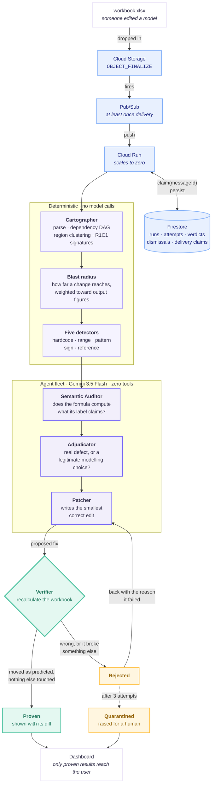
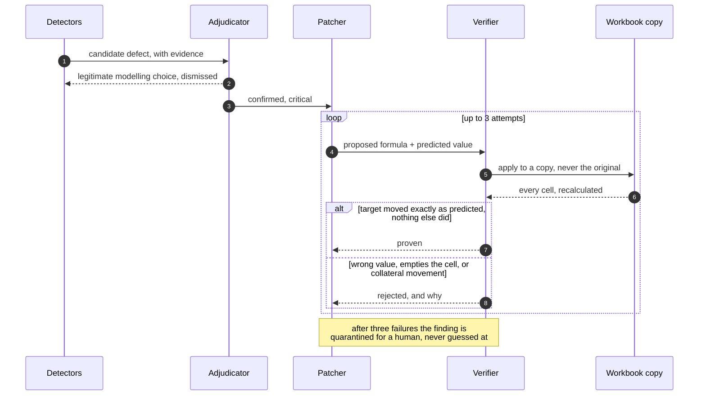

# Architecture

## The whole system

## The verification loop

The whole system exists to make this loop trustworthy. Nothing reaches the user that has not been through it.

## Where the model is trusted, and where it is not

```mermaid
flowchart LR
    subgraph NEVER ["Never asks the model"]
        direction TB
        N1["parsing the workbook"]
        N2["building the dependency graph"]
        N3["clustering regions"]
        N4["locating candidates"]
        N5["<b>verifying every repair</b>"]
        N6["deciding what happens next"]
    end

    subgraph ASKS ["Asks the model"]
        direction TB
        Y1["does this formula compute<br/>what its label claims?"]
        Y2["is this a defect, or a<br/>legitimate modelling choice?"]
        Y3["what is the correct repair?"]
    end

    ASKS -->|"every answer is checked<br/>by recalculation"| NEVER

    classDef never fill:#E4F8F1,stroke:#4FC3A1,stroke-width:2px,color:#23795F
    classDef asks fill:#F2EFFB,stroke:#7B6CF6,stroke-width:2px,color:#33304A
    class N1,N2,N3,N4,N5,N6 never
    class Y1,Y2,Y3 asks
```

Three questions go to Gemini. Each is one a parser genuinely cannot answer. Everything else, including the verification that decides whether the model was right, is plain code.

The agents hold **no tools at all**. Not one can read a file, mutate a workbook, or reach the network. Each receives evidence that deterministic code assembled and returns a typed judgement. A prompt injected into a cell label can at worst produce a wrong judgement, which the Verifier then rejects by recalculating, because the Verifier asks the model nothing.
